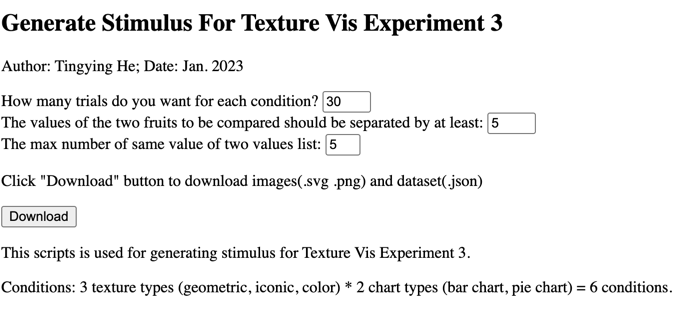

# Experiment 3 Stimulus Generator

This script is used to generate stimuli for Experiment 3 of the paper:
Design Characterization for Black-and-White Textures in Visualization
DOI: 10.1109/TVCG.2023.3326941

Original experiment code:
https://github.com/tingying-he/design-characterization-for-black-and-white-textures-in-visualization/tree/main/experiments-codes/experiment3

## Usage

We mainly work in the `generate_stimuli` folder.
Run: `generate_images.php`

You should then see: 
 
Click the Download button to download the images (`.svg`, `.png`) and the dataset corresponding to the stimuli (`.json`).

Generated files will appear in the following folders:

`generated_svg/`

`generated_png/`

`generated_json/`

For the experiment, you need to run `generate_images.php` **twice**, since the study includes both formal trials and training trials.

Configuration:

* Formal study:

How many trials do you want for each condition? 10

* Training sessions

How many trials do you want for each condition? 30 (as in the original study)

Reason for 30: when participants answered incorrectly, they were given a new chart. Therefore, a larger number of training stimuli was needed.

## Notes for Replication

The script generates charts using random data. As a result, the charts produced by this script will not be identical to those in the original study. This is intentional and aligns with our study design, which relied on randomized datasets for the stimuli.
If you need the exact stimuli used in the original study, they can be found here:
https://github.com/tingying-he/design-characterization-for-black-and-white-textures-in-visualization/tree/main/experiments-codes/experiment3/html/stimuli